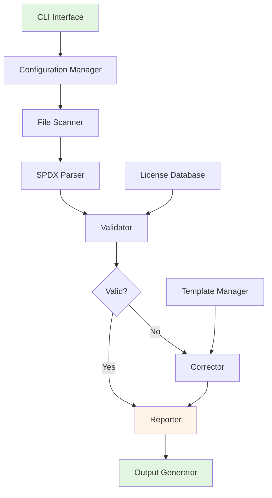

# Design Document

## Overview

This document describes the technical design for the SPDX License Declaration Scanner Tool. The tool will be implemented as a command-line application with a modular architecture that can scan source code files, detect and validate SPDX license declarations, and automatically correct or complete missing license information according to UnionTech's open source code declaration requirements and SPDX specification standards.

The design follows a pipeline architecture where files flow through scanning, parsing, validation, correction, and reporting phases, with each phase being independently testable and configurable.

## Steering Document Alignment

### Technical Standards (tech.md)
Since this is a new project, we'll establish technical standards:
- **Language**: Python 3.8+ for cross-platform compatibility and rich ecosystem
- **Architecture**: Modular, plugin-based design with clear separation of concerns
- **Standards**: Follow SPDX specification v2.2+, PEP 8 style guidelines
- **Dependencies**: Minimize external dependencies, use standard library where possible

### Project Structure (structure.md)
The implementation will follow a clean architecture pattern:
```
spdx-scanner/
├── src/
│   ├── scanner/        # File discovery and reading
│   ├── parser/         # SPDX declaration parsing
│   ├── validator/      # SPDX syntax and semantic validation
│   ├── corrector/      # License declaration correction
│   ├── reporter/       # Report generation and output
│   ├── config/         # Configuration management
│   ├── models/         # Data models and types
│   ├── utils/          # Utility functions
│   └── cli/            # Command-line interface
├── tests/              # Comprehensive test suite
├── templates/          # License header templates
├── docs/               # Documentation
└── examples/           # Usage examples
```

## Code Reuse Analysis

### Existing Components to Leverage
- **Python Standard Library**: `argparse`, `pathlib`, `re`, `json`, `concurrent.futures`
- **SPDX Tools**: Existing SPDX Python libraries for validation (optional dependency)
- **Template Engine**: Jinja2 for customizable license headers (optional)

### Integration Points
- **Git Hooks**: Pre-commit integration for automated checking
- **CI/CD Systems**: Exit codes and machine-readable reports for automation
- **IDE Plugins**: Future integration with popular development environments

## Architecture

The tool follows a pipeline architecture with these core components:



### Modular Design Principles
- **Single File Responsibility**: Each module handles one specific aspect (scanning, parsing, validation, etc.)
- **Component Isolation**: Core logic separated from CLI interface for library usage
- **Service Layer Separation**: Clear boundaries between data processing, business logic, and presentation
- **Utility Modularity**: Helper functions grouped by functionality (file operations, SPDX handling, etc.)

## Components and Interfaces

### Component 1: File Scanner
- **Purpose**: Discover and read source code files based on configuration
- **Interfaces**:
  - `scan_directory(path, patterns) -> List[FileInfo]`
  - `read_file_info(filepath) -> FileInfo`
- **Dependencies**: `pathlib`, `glob`, `mimetypes`
- **Reuses**: Standard Python file handling utilities

### Component 2: SPDX Parser
- **Purpose**: Extract and parse SPDX license declarations from source files
- **Interfaces**:
  - `parse_spdx_declarations(content) -> SPDXInfo`
  - `extract_license_header(content) -> str`
- **Dependencies**: `re` (regex), custom SPDX grammar definitions
- **Reuses**: Language-specific comment parsing patterns

### Component 3: Validator
- **Purpose**: Validate SPDX declarations for syntax and semantic correctness
- **Interfaces**:
  - `validate_spdx_info(spdx_info) -> ValidationResult`
  - `check_license_compatibility(license_id) -> bool`
- **Dependencies**: SPDX license database, validation rules
- **Reuses**: SPDX specification validation logic

### Component 4: Corrector
- **Purpose**: Fix or complete missing SPDX license declarations
- **Interfaces**:
  - `correct_file(file_info, correction_rules) -> CorrectionResult`
  - `generate_license_header(template, context) -> str`
- **Dependencies**: Template engine, correction rules engine
- **Reuses**: Language-specific formatting rules

### Component 5: Reporter
- **Purpose**: Generate reports in various formats
- **Interfaces**:
  - `generate_report(results, format) -> Report`
  - `format_output(report, output_type) -> str`
- **Dependencies**: JSON, HTML, Markdown formatters
- **Reuses**: Existing reporting libraries (optional)

## Data Models

### SPDXInfo
```python
@dataclass
class SPDXInfo:
    license_identifier: Optional[str]
    copyright_text: Optional[str]
    project_attribution: Optional[str]
    spdx_version: Optional[str]
    validation_errors: List[str]
    declaration_type: str  # 'header', 'inline', 'separate'
```

### FileInfo
```python
@dataclass
class FileInfo:
    filepath: Path
    language: str
    content: str
    encoding: str
    line_endings: str
    has_shebang: bool
    spdx_info: Optional[SPDXInfo]
```

### ValidationResult
```python
@dataclass
class ValidationResult:
    is_valid: bool
    errors: List[ValidationError]
    warnings: List[ValidationWarning]
    suggestions: List[str]
```

### CorrectionResult
```python
@dataclass
class CorrectionResult:
    original_content: str
    corrected_content: str
    changes_made: List[str]
    backup_created: bool
    success: bool
    error_message: Optional[str]
```

## Error Handling

### Error Scenarios
1. **File Access Errors**: Permission denied, file not found
   - **Handling**: Log error, skip file, continue processing
   - **User Impact**: Warning in report indicating which files couldn't be processed

2. **Invalid SPDX Syntax**: Malformed license identifiers, incorrect format
   - **Handling**: Mark as validation error, attempt correction if possible
   - **User Impact**: Detailed error message with line number and correction suggestion

3. **Template Rendering Errors**: Missing template variables, template syntax errors
   - **Handling**: Fall back to default template, log error
   - **User Impact**: Warning about template issue, uses safe defaults

4. **Configuration Errors**: Invalid settings, missing required parameters
   - **Handling**: Validate configuration on startup, provide clear error messages
   - **User Impact**: Immediate feedback with specific configuration issues

## Testing Strategy

### Unit Testing
- Test each component in isolation with mocked dependencies
- Focus on edge cases (empty files, malformed SPDX, various languages)
- Test configuration validation and error handling
- Achieve >90% code coverage for core logic

### Integration Testing
- Test complete pipeline from CLI to report generation
- Test with real-world codebases of various sizes
- Verify cross-platform compatibility (Windows, macOS, Linux)
- Test Git hook integration scenarios

### End-to-End Testing
- Create test repositories with known SPDX issues
- Verify tool correctly identifies and fixes all issues
- Test report generation and formatting
- Validate performance with large codebases (10k+ files)