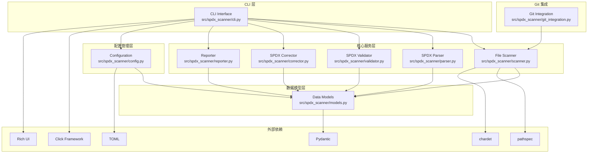
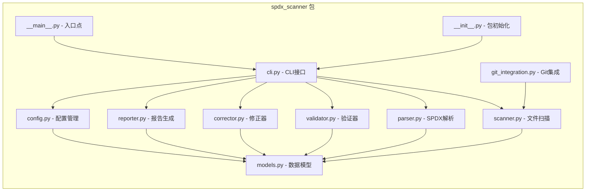
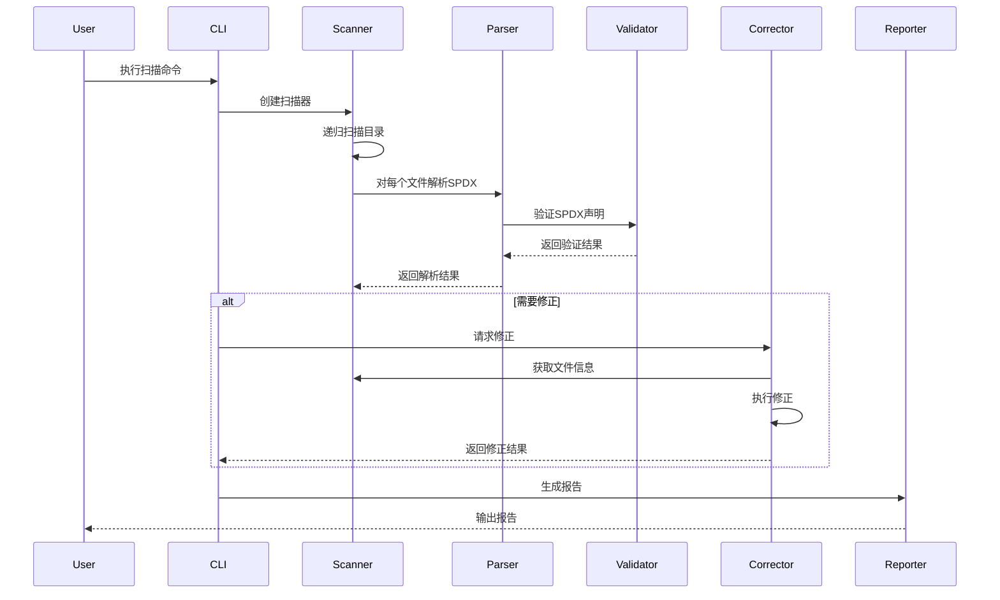

# SPDX Scanner - 项目架构文档

## 项目概述

SPDX Scanner 是一个自动化的 SPDX（Software Package Data Exchange）许可证声明扫描器和修正工具。该工具扫描项目源代码，识别缺失或不正确的 SPDX 许可证声明，并根据 SPDX 规范标准自动修正它们。

## 核心架构

### 系统架构图



### 模块架构



## 核心组件详解

### 1. CLI 接口 (cli.py)
- **功能**: 提供命令行界面，使用 Click 框架和 Rich 库增强输出
- **主要命令**: scan, correct, install-hook
- **特性**: 支持多种输出格式、进度条、表格显示

### 2. 文件扫描器 (scanner.py)
- **功能**: 递归扫描目录，识别需要处理的文件
- **特性**: 支持文件模式匹配、编码检测、二进制文件识别
- **依赖**: pathspec, chardet

### 3. SPDX 解析器 (parser.py)
- **功能**: 从源代码文件中提取和解析现有的 SPDX 许可证声明
- **支持**: 多种编程语言的注释语法
- **输出**: SPDXInfo 数据模型

### 4. 验证器 (validator.py)
- **功能**: 验证 SPDX 声明是否符合规范标准
- **检查项**: 许可证标识符有效性、版权声明格式、必需字段
- **输出**: ValidationResult 包含错误、警告和建议

### 5. 修正器 (corrector.py)
- **功能**: 自动修正缺失或不正确的许可证声明
- **特性**: 支持备份原始文件、语言特定的模板
- **输出**: CorrectionResult 包含修改详情

### 6. 报告生成器 (reporter.py)
- **功能**: 生成多种格式的扫描报告
- **支持格式**: JSON、HTML、Markdown、CSV
- **特性**: 可自定义报告模板和内容

### 7. 数据模型 (models.py)
- **核心模型**:
  - `SPDXInfo`: SPDX 许可证信息
  - `FileInfo`: 文件元数据和 SPDX 分析结果
  - `ValidationResult`: 验证结果
  - `CorrectionResult`: 修正结果
  - `ScanResult`: 扫描结果
  - `ScanSummary`: 扫描摘要

### 8. 配置管理 (config.py)
- **功能**: 管理项目配置和设置
- **支持**: JSON 配置文件、环境变量、命令行参数
- **配置项**: 默认许可证、项目信息、文件模式等

### 9. Git 集成 (git_integration.py)
- **功能**: 提供 Git 钩子和 Git 感知的扫描
- **特性**: 预提交钩子、仅扫描修改的文件

## 数据流架构



## 模块依赖关系

### 依赖层次
1. **基础层**: models.py（所有模块依赖）
2. **工具层**: config.py, git_integration.py
3. **核心层**: scanner.py, parser.py, validator.py, corrector.py, reporter.py
4. **接口层**: cli.py
5. **入口层**: __main__.py, __init__.py

### 外部依赖
- **CLI**: click, rich
- **数据验证**: pydantic
- **配置**: toml
- **文件处理**: pathspec, chardet
- **测试**: pytest, pytest-cov, pytest-benchmark, hypothesis
- **代码质量**: black, flake8, mypy, isort
- **Git**: pre-commit

## 测试架构

### 测试策略
- **单元测试**: 测试各个组件的独立功能
- **集成测试**: 测试组件间的交互
- **基准测试**: 性能测试（使用 pytest-benchmark）
- **属性测试**: 使用 Hypothesis 进行健壮性测试

### 测试文件映射
```
tests/
├── test_models.py          # 数据模型测试
├── test_scanner.py         # 扫描器测试
├── test_parser.py          # 解析器测试
├── test_validator.py       # 验证器测试
├── test_corrector.py       # 修正器测试
├── test_reporter.py        # 报告生成器测试
├── test_config.py          # 配置管理测试
├── test_git_integration.py # Git集成测试
└── test_integration.py     # 集成测试
```

## 构建和部署

### 构建系统
- **构建后端**: setuptools
- **配置**: pyproject.toml（现代 Python 打包标准）
- **包格式**: wheel 和 source distribution

### 开发工具
- **代码格式化**: Black（行长度 88）
- **导入排序**: isort（兼容 Black）
- **类型检查**: mypy（严格模式）
- **代码检查**: flake8
- **预提交钩子**: pre-commit

### 持续集成
- **测试**: pytest 支持多种标记（slow, integration, unit）
- **覆盖率**: pytest-cov，目标覆盖率跟踪
- **多环境**: tox 支持

## 扩展性设计

### 插件架构
- **语言支持**: 可扩展的语言检测和注释语法
- **报告格式**: 可插拔的报告生成器
- **验证规则**: 可配置的验证规则集

### 配置扩展
- **项目级配置**: spdx-scanner.config.json
- **用户级配置**: ~/.config/spdx-scanner/
- **环境变量**: SPDX_SCANNER_* 前缀

## 性能考虑

### 优化策略
- **增量扫描**: 基于文件修改时间的增量处理
- **并行处理**: 支持多文件并行扫描
- **内存管理**: 流式处理大文件
- **缓存**: 解析结果缓存（可选）

### 基准测试
- **pytest-benchmark**: 集成性能测试
- **内存分析**: 内存使用跟踪
- **性能回归**: 性能变化检测

## 安全考虑

### 文件安全
- **路径验证**: 防止目录遍历攻击
- **符号链接**: 安全的符号链接处理
- **文件权限**: 尊重文件系统权限

### 内容安全
- **编码检测**: 自动编码检测和处理
- **二进制文件**: 安全的二进制文件识别
- **内容验证**: SPDX 声明语法验证

## 许可证合规

### SPDX 规范遵循
- **版本支持**: SPDX 2.2+ 规范
- **许可证标识符**: 使用 SPDX 许可证列表
- **版权声明**: 标准版权格式

### 开源合规
- **MIT 许可证**: 项目采用 MIT 许可证
- **依赖合规**: 所有依赖项许可证检查
- **归属声明**: 第三方组件归属

---

**最后更新**: 2025年10月24日
**文档版本**: 1.0
**维护者**: SPDX Scanner 团队