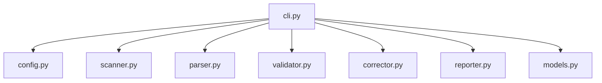

# SPDX Scanner 模块文档 - CLI 接口模块

## 模块概述

`cli.py` 模块提供了 SPDX Scanner 的命令行界面，使用 Click 框架构建，并通过 Rich 库提供增强的用户界面体验。

## 核心功能

### 主要命令
- `scan`: 扫描目录中的 SPDX 许可证声明
- `correct`: 自动修正缺失或不正确的 SPDX 声明
- `install-hook`: 安装 Git 预提交钩子

### 界面特性
- **丰富的输出**: 使用 Rich 库提供彩色输出、表格、进度条
- **多种格式**: 支持 JSON、HTML、Markdown、CSV 报告格式
- **进度显示**: 实时显示扫描进度和状态
- **错误处理**: 友好的错误消息和建议

## 架构设计

### 依赖关系


### 外部依赖
- **click**: 命令行框架
- **rich**: 富文本用户界面
- **logging**: Python 标准日志库

## 使用示例

### 基本扫描
```bash
# 扫描当前目录
spdx-scanner scan .

# 扫描指定目录并生成 HTML 报告
spdx-scanner scan /path/to/project --format html --output report.html

# 详细输出模式
spdx-scanner scan . --verbose
```

### 自动修正
```bash
# 自动修正 SPDX 声明
spdx-scanner correct /path/to/project

# 预览修正（不实际修改文件）
spdx-scanner correct /path/to/project --dry-run

# 指定默认许可证
spdx-scanner correct . --license MIT
```

### Git 集成
```bash
# 安装预提交钩子
spdx-scanner install-hook

# 仅扫描 Git 跟踪的文件
spdx-scanner scan . --git-only
```

## 配置选项

### 全局选项
- `--config, -c`: 指定配置文件路径
- `--verbose, -v`: 启用详细输出
- `--quiet, -q`: 静默模式
- `--format`: 输出格式（json, html, markdown, csv）
- `--output, -o`: 输出文件路径

### 扫描选项
- `--include`: 包含的文件模式
- `--exclude`: 排除的文件模式
- `--recursive, -r`: 递归扫描（默认）
- `--git-only`: 仅扫描 Git 跟踪的文件

### 修正选项
- `--dry-run`: 预览修正而不修改文件
- `--license`: 指定默认许可证
- `--backup`: 创建备份文件
- `--no-backup`: 不创建备份

## 错误处理

### 常见错误
1. **文件访问错误**: 权限不足或文件被锁定
2. **配置错误**: 配置文件格式错误或路径无效
3. **许可证错误**: 无效的 SPDX 许可证标识符
4. **Git 错误**: Git 仓库状态异常

### 错误恢复
- 自动回滚失败的修正操作
- 提供详细的错误信息和解决建议
- 支持部分成功场景的处理

## 性能优化

### 扫描优化
- **增量扫描**: 基于文件修改时间的智能扫描
- **并行处理**: 支持多文件并行处理
- **内存管理**: 流式处理大文件

### 输出优化
- **分页显示**: 大量结果的分页展示
- **过滤选项**: 基于严重性和类型的结果过滤
- **摘要模式**: 快速概览模式

## 扩展性

### 自定义命令
- 支持通过插件扩展新命令
- 可自定义的输出格式器
- 可配置的验证规则

### 主题和样式
- 支持自定义 Rich 主题
- 可配置的颜色方案
- 国际化支持框架

## 测试覆盖

### 测试策略
- **单元测试**: 测试各个命令的处理逻辑
- **集成测试**: 测试完整的命令流程
- **UI 测试**: 测试输出格式和样式

### 测试文件
- `tests/test_cli.py`: CLI 功能测试
- `tests/test_integration.py`: 端到端集成测试

## 维护指南

### 添加新命令
1. 在 `cli.py` 中创建新的命令函数
2. 使用适当的 Click 装饰器
3. 添加 Rich 输出格式化
4. 更新帮助文档
5. 添加相应的测试用例

### 修改输出格式
1. 更新 Rich 表格或面板配置
2. 确保向后兼容性
3. 更新相关测试
4. 文档化变更

### 性能调优
1. 使用 Python 性能分析工具
2. 优化文件 I/O 操作
3. 考虑异步处理选项
4. 监控内存使用情况

## 相关文档

- [主项目文档](../CLAUDE.md)
- [数据模型文档](models.md)
- [配置管理文档](config.md)
- [扫描器文档](scanner.md)

---

**模块路径**: `src/spdx_scanner/cli.py`
**最后更新**: 2025年10月24日
**维护者**: SPDX Scanner 团队